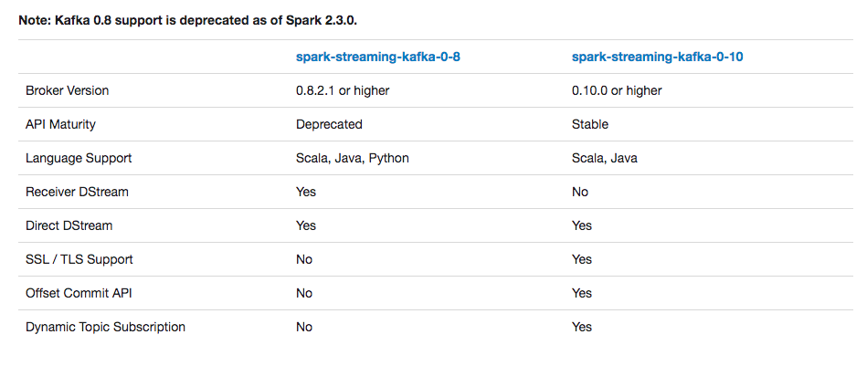

[TOC]
### 简介
本文主要是讲解Spark Streaming与kafka结合的新增分区检测的问题。读本文前关于kafka与Spark Streaming结合问题请参考下面两篇文章：

1，[必读：再讲Spark与kafka 0.8.2.1+整合](https://mp.weixin.qq.com/s/FYw7dtQLLukAmkLqmQ0-Vg)

2，[必读：Spark与kafka010整合](https://mp.weixin.qq.com/s/AMxi1R2A-2wSEz8tsNc_vg)

读本文前是需要了解Spark Streaming的原理和源码结构基础。

Spark Streaming源码系列视频教程请点阅读原文进入浪尖的知识星球：Spark技术学院。

首先看看官网给出的数据



### kafka 0.8版本

进入正题，之所以会有今天题目的疑惑，是由于在08版本kafka和Spark Streaming结合的DirectStream这种形式的API里面，是不支持kafka新增分区或者topic检测的。而这个问题，对于很多业务增长比较明显的公司都是会有碰到相应的问题。

比如，原来的公司业务增长比较明显，那么kafka吞吐量，刚开始创建的topic数目和分区数目可能满足不了并发需求，需要增加分区。新增加的分区会有生产者往里面写数据，而Spark Streaming跟kafka 0.8版本结合的API是满足不了动态发现kafka新增topic或者分区的需求的。

这么说有什么依据吗？我们做项目不能人云亦云，所以我们可以从源码入手验证我们的想法。

我们在这里不会详细讲Spark Streaming源码，但是我们可以在这里思考一下，Spark Streaming分区检测是在哪做的？

很明显对于批处理的Spark Streaming任务来说，分区检测应该在每次job生成获取kafkaRDD，也即是在给kafkaRDD确定分区数并且每个分区赋值offset范围的时候，而这段代码就在DirectKafkaInputDStream#compute方法中。(看过浪尖Spark Streaming源码视频教程的肯定会知道）

那么我们就贴出这块源码去验证我们的想法，首先compute方法的第一行：

val untilOffsets = clamp(latestLeaderOffsets(maxRetries))

这里面获取的是当前生成KafkaRDD每个分区消费的offset的最大值，那么我们需要进入latestLeaderOffsets进一步去看，可以发现下面一行代码：

```scala
val o = kc.getLatestLeaderOffsets(currentOffsets.keySet)
```


这个是根据currentOffsets信息来获取最大的offset，由此此处继续深入发现，由于它只是根据currentOffsets信息来获取最大的offset，没有去感知新增的分区，所以Spark Streaming与kafka 0.8结合是不能动态感知分区的。

### kafka 0.10版本

相似的我们也可以直接去看kafka 0.10这块的源码去检查，他是否会动态生成kafka分区。

进入DirectKafkaInputDStream的compute，看到的第一行代码也是：
```scala
val untilOffsets = clamp(latestOffsets())
```


在latestOffsets里面，有了新的大陆：

```scala
 /**
   * Returns the latest (highest) available offsets, taking new partitions into account.
   */
  protected def latestOffsets(): Map[TopicPartition, Long] = {
    val c = consumer
    paranoidPoll(c)
    // 获取所有的分区信息
    val parts = c.assignment().asScala

    // make sure new partitions are reflected in currentOffsets
    // 做差获取新增的分区信息
    val newPartitions = parts.diff(currentOffsets.keySet)
    // position for new partitions determined by auto.offset.reset if no commit
    // 新分区消费位置，没有记录的化是由auto.offset.reset决定
    currentOffsets = currentOffsets ++ newPartitions.map(tp => tp -> c.position(tp)).toMap
    // don't want to consume messages, so pause
    c.pause(newPartitions.asJava)
    // find latest available offsets
    c.seekToEnd(currentOffsets.keySet.asJava)
    parts.map(tp => tp -> c.position(tp)).toMap
  }
```

到这里本文就算结束了，kafka 0.10版本与SparkStreaming结合支持新增分区检测，这件事告诉我们没事要多看源码，增长见识。

欢迎关注浪尖公众号：

或者加入知识星球
